# AI Triad Model Documentation

## Overview

The AI Triad Model is a production-ready, intelligent workflow automation platform built with **Pydantic AI** as the core agent framework. Designed for **seamless integration** into existing organizational systems, it can enhance current processes or create entirely new automated workflows. This documentation covers the complete system architecture, implementation details, and deployment strategies for both greenfield and brownfield implementations.

## 🍁 The Triad Model: Constitutional AI Design

### Authentic Canadian Westminster Parliamentary System

The AI Triad Model is built as a **fully authentic Westminster parliamentary system** inspired by the **Canadian constitutional framework**. This isn't just inspiration - it's a complete implementation of Westminster governance principles adapted for AI systems, including all democratic safeguards, accountability mechanisms, and constitutional conventions.

### **Constitutional Mapping:**

| **Canadian Government** | **AI Triad Agent** | **Core Function** | **Westminster Powers** |
|------------------------|-------------------|-------------------|----------------------|
| **Legislative Branch** (Parliament) | **Planner Agent** | Creates laws, policies, and strategic plans | Question Period, Parliamentary Scrutiny, Collective Responsibility |
| **Executive Branch** (PM/Cabinet) | **Executor Agent** | Implements and executes policies/workflows | Ministerial Responsibility, Cabinet Solidarity, Confidence & Supply |
| **Judicial Branch** (Courts) | **Evaluator Agent** | Reviews, validates, and ensures compliance | Constitutional Review, Legal Interpretation, Appeal Authority |
| **Crown/Governor General** | **Overwatch Agent** | Constitutional oversight and final authority | Reserve Powers, Royal Assent, Emergency Powers, Constitutional Crisis Resolution |

### **Complete Westminster Constitutional Framework:**

#### **🏛️ Core Democratic Principles**
1. **Parliamentary Sovereignty**: Collective agent decision-making with democratic accountability
2. **Responsible Government**: Agents must maintain confidence of the system
3. **Rule of Law**: All agents operate within constitutional constraints
4. **Separation of Powers**: No single agent can act unilaterally without validation
5. **Constitutional Monarchy**: Crown (Overwatch) provides constitutional oversight and emergency powers

#### **🗳️ Democratic Accountability Mechanisms**
1. **Question Period**: Formal mechanism for agents to challenge each other's decisions
2. **Vote of No Confidence**: Agents can withdraw support, triggering constitutional crises
3. **Parliamentary Scrutiny**: Dedicated committees for ongoing oversight and performance review
4. **Collective Cabinet Responsibility**: All agents collectively responsible for major decisions
5. **Opposition Role**: Formal opposition challenging government decisions

#### **👑 Crown Reserve Powers (Overwatch Agent)**
1. **Dismissal Power**: Remove non-performing or non-compliant agents
2. **Dissolution Power**: Reset entire agent system during constitutional crises
3. **Appointment Power**: Appoint interim agents during transitions
4. **Royal Assent**: Final approval authority for major system decisions
5. **Emergency Powers**: Direct intervention during system emergencies

#### **📜 Constitutional Conventions & Evolution**
1. **Precedent-Based Development**: System learns and establishes new constitutional conventions
2. **Parliamentary Record**: Complete Hansard-equivalent recording of all decisions and debates
3. **Constitutional Crisis Management**: Formal procedures for handling deadlocks and conflicts
4. **Evolutionary Flexibility**: Constitutional framework adapts while maintaining core principles

### **The Sacred Triangle:**
```
        Planner
       (Legislative)
           ↓
    Creates Plans
           ↓
       Executor  ←→  Evaluator
     (Executive)    (Judicial)
           ↑           ↓
    Implements ←  Validates
           ↑           ↓
        Feedback Loop
```

This constitutional design prevents AI "tyranny" by ensuring **no single agent can make unilateral decisions**, creating a **self-governing, accountable AI system** that mirrors democratic principles.

> *"Just as the Canadian Parliament, Prime Minister, and Supreme Court must work in harmony with constitutional oversight, our AI agents operate within a framework of mutual accountability and transparent governance."*

## 🔄 Integration Philosophy

### Universal Adaptability
The AI Triad Model is designed to **integrate with any existing system** - from legacy enterprise applications to modern cloud-native architectures. Whether you're:

- **Starting from scratch**: Full greenfield deployment with complete workflow automation
- **Enhancing existing processes**: Brownfield integration that augments current systems
- **Hybrid approach**: Selective automation of specific processes while maintaining existing workflows

### Integration Scenarios

| **Scenario** | **Implementation** | **Benefits** |
|--------------|-------------------|--------------|
| **Legacy System Enhancement** | MCP adapters for existing databases, APIs, and workflows | Modernize without disruption |
| **Microservices Integration** | A2A protocol bridges to existing service mesh | Constitutional oversight of distributed systems |
| **Process Automation** | Agent-driven automation of manual workflows | Maintain human oversight through constitutional design |
| **Compliance & Governance** | Built-in validation and audit trails | Meet regulatory requirements with democratic AI principles |

## Documentation Structure

### Core Documentation

1. **[Architecture](architecture.md)** - Overall system architecture using Pydantic AI framework with Westminster constitutional principles
2. **[Agents](agents.md)** - Detailed implementation of the four core agents with parliamentary procedures and collective responsibility
3. **[Tools and Dependencies](tools-and-dependencies.md)** - Tool system and dependency injection with Crown prerogative powers
4. **[Constitutional Crisis Management](constitutional-crisis-management.md)** - Westminster crisis management, reserve powers, and constitutional safeguards
5. **[API Endpoints](api-endpoints.md)** - FastAPI REST endpoints with parliamentary authentication and question period interfaces
6. **[Testing and Deployment](testing-and-deployment.md)** - Constitutional compliance testing and production deployment with Westminster oversight
7. **[Security](security.md)** - Constitutional security architecture with zero-trust and democratic governance
8. **[Migration Guide](migration-guide.md)** - Brownfield integration guide with constitutional validation and rollback procedures
9. **[Scalability](scalability.md)** - Performance and scaling strategies with constitutional load balancing
10. **[Operations](operations.md)** - Maintenance procedures with Westminster operational governance
11. **[Monitoring and Observability](monitoring-and-observability.md)** - Parliamentary oversight, scrutiny committees, and constitutional monitoring
12. **[Evals and Performance](evals-and-performance.md)** - Agent performance testing with constitutional compliance validation
13. **[Graph Workflows and Sub-Agents](graph-workflows-and-sub-agents.md)** - Complex workflow orchestration with constitutional sub-agent governance

## Key Features

### 🤖 Intelligent Agent System
- **Planner Agent**: Strategic workflow design with graph-based sub-agent spawning
- **Executor Agent**: Parallel task execution with specialized sub-agents
- **Evaluator Agent**: Multi-dimensional validation with performance evals
- **Overwatch Agent**: System monitoring and anomaly detection with comprehensive tracing

### 🔧 Technical Stack
- **Pydantic AI**: Type-safe agent framework with dependency injection
- **A2A Protocol**: Agent-to-agent communication and orchestration
- **MCP (Model Context Protocol)**: **Universal integration layer** - connects to any existing system, database, API, or tool
- **Pydantic AI Graphs**: Complex workflow orchestration and state management
- **Pydantic AI Evals**: Systematic agent performance testing and improvement
- **Logfire**: Comprehensive observability and monitoring platform
- **FastAPI**: High-performance API layer with extensive integration capabilities
- **PostgreSQL**: Primary database with async support (can integrate with existing databases)
- **Docker**: Containerized deployment for any infrastructure

### 🏗️ Architecture Principles
- **Integration-First**: Designed to work with existing systems without disruption
- **Constitutional Governance**: Democratic AI principles ensure accountability and transparency
- **Type Safety**: Full static type checking with Pydantic models
- **Dependency Injection**: Clean, testable dependency management
- **Tool Composition**: Modular, reusable tool system that adapts to existing infrastructure
- **Graph-Based Orchestration**: Complex workflow management with state persistence
- **Sub-Agent Spawning**: Dynamic task decomposition with specialized agents
- **Continuous Evaluation**: Systematic performance testing and improvement
- **Async-First**: High-concurrency async/await patterns
- **Production Ready**: Comprehensive error handling, monitoring, and testing
- **Universal Compatibility**: Works with legacy systems, modern cloud, and hybrid environments

## Quick Start

### Development Setup

```bash
# Clone repository
git clone <repository-url>
cd Triad-Model

# Install dependencies
pip install -r requirements.txt
pip install 'pydantic-ai-slim[a2a]'  # A2A protocol support
pip install pydantic-graph            # Graph workflows
pip install logfire                   # Observability platform

# Set up environment
cp .env.example .env
# Edit .env with your configuration including:
# - LOGFIRE_TOKEN=your_logfire_token
# - OPENAI_API_KEY=your_openai_key
# - ANTHROPIC_API_KEY=your_anthropic_key

# Start development services
docker-compose up -d db

# Configure Logfire
logfire auth

# Run migrations
alembic upgrade head

# Start development server with Logfire instrumentation
uvicorn backend.main:app --reload --host 0.0.0.0 --port 8000
```

### Production Deployment

```bash
# Build and deploy with Docker Compose
docker-compose -f docker-compose.prod.yml up -d

# Or use the deployment script
chmod +x deploy.sh
./deploy.sh
```

## Agent Communication Flow

```mermaid
graph TD
    %% Main Constitutional Triad (Westminster System)
    A[Planner Agent<br/>📜 Legislative Branch] -->|A2A Protocol| B[Executor Agent<br/>⚖️ Executive Branch]
    B -->|A2A Protocol| C[Evaluator Agent<br/>🏛️ Judicial Branch]
    C -->|Constitutional Feedback| A
    D[Overwatch Agent<br/>👑 Crown Authority] -->|Constitutional Oversight| A
    D -->|Constitutional Oversight| B
    D -->|Constitutional Oversight| C
    
    %% Sub-Agent Constitutional Compliance (Must follow Triad principles)
    A -->|Constitutional Authority| A1[Planning Sub-Agents<br/>📋 Legislative Sub-Branch]
    A1 -->|Must be Executed| B1[Execution Sub-Agents<br/>⚡ Executive Sub-Branch]
    B1 -->|Must be Validated| C1[Validation Sub-Agents<br/>✅ Judicial Sub-Branch]
    C1 -->|Constitutional Feedback| A1
    
    %% Constitutional Enforcement
    CV[Constitutional Validator<br/>⚖️ Triad Compliance] -->|Enforces Separation of Powers| A1
    CV -->|Enforces Separation of Powers| B1
    CV -->|Enforces Separation of Powers| C1
    
    %% Sub-Agent Specializations (Under Constitutional Authority)
    A1 -->|Domain Expertise| A2[Data Pipeline Planner]
    A1 -->|Domain Expertise| A3[API Integration Planner] 
    A1 -->|Domain Expertise| A4[Security Planner]
    
    B1 -->|Parallel Execution| B2[Data Processor]
    B1 -->|Parallel Execution| B3[API Integrator]
    B1 -->|Parallel Execution| B4[File Processor]
    
    C1 -->|Multi-Dimensional| C2[Data Quality Validator]
    C1 -->|Multi-Dimensional| C3[Performance Validator]
    C1 -->|Multi-Dimensional| C4[Security Validator]
    
    %% Constitutional Reporting Chain
    A1 -->|Reports to Crown| D
    B1 -->|Reports to Crown| D
    C1 -->|Reports to Crown| D
    CV -->|Constitutional Compliance| D
    
    %% External Systems (Under Constitutional Authority)
    E[MCP Tools] -->|External Integration| A
    E -->|External Integration| B
    E -->|External Integration| C
    
    F[Logfire] -->|Observability| A
    F -->|Observability| B
    F -->|Observability| C
    F -->|Observability| D
    F -->|Constitutional Monitoring| A1
    F -->|Constitutional Monitoring| B1
    F -->|Constitutional Monitoring| C1
    F -->|Constitutional Monitoring| CV
    
    G[Pydantic Evals] -->|Performance Testing| A
    G -->|Performance Testing| B
    G -->|Performance Testing| C
    G -->|Constitutional Compliance Testing| CV
    G -->|Continuous Improvement| A1
    G -->|Continuous Improvement| B1
    G -->|Continuous Improvement| C1

    %% Styling
    classDef legislative fill:#e1f5fe
    classDef executive fill:#f3e5f5
    classDef judicial fill:#e8f5e8
    classDef crown fill:#fff3e0
    classDef constitutional fill:#ffebee
    
    class A,A1,A2,A3,A4 legislative
    class B,B1,B2,B3,B4 executive
    class C,C1,C2,C3,C4 judicial
    class D crown
    class CV constitutional
```



## Key Components

### Agents
Each agent is implemented using Pydantic AI's agent system with:
- Type-safe dependencies
- Graph-based workflow orchestration
- Sub-agent spawning capabilities
- Tool integration and composition
- Output validation with evals
- Error handling and retries
- Comprehensive Logfire logging

### Graph Workflows
Sophisticated workflow management providing:
- Dynamic sub-agent spawning for complex tasks
- Stateful execution with persistence
- Parallel task execution with resource management
- Multi-dimensional validation workflows
- Error recovery and partial result preservation

### Performance Evaluation
Continuous improvement system providing:
- Systematic agent performance testing
- Custom evaluation datasets and metrics
- Automated daily evaluation pipelines
- Performance trend analysis and alerting
- Data-driven optimization recommendations

### Tools
Modular tool system providing:
- Workflow management and orchestration tools
- Specialized execution tools for sub-agents
- Multi-dimensional validation and quality tools
- A2A communication and MCP integration tools
- Monitoring and observability tools

### API Layer
FastAPI-based REST API with:
- Authentication and authorization
- Input validation
- Async request handling
- WebSocket support for real-time updates
- Comprehensive error handling

### Database Layer
PostgreSQL with:
- Async SQLAlchemy
- Database migrations with Alembic
- Connection pooling
- Query optimization

## Testing Strategy

### Test Categories
- **Unit Tests**: Individual component testing with mocks
- **Integration Tests**: Agent interaction testing
- **API Tests**: FastAPI endpoint testing
- **Performance Tests**: Load and stress testing

### Test Tools
- **Pytest**: Primary testing framework
- **TestModel**: Pydantic AI model mocking
- **pytest-asyncio**: Async test support
- **TestClient**: FastAPI test client

## Deployment Options

### 🚀 Integration Deployment Scenarios

#### **Scenario 1: Greenfield Deployment (Starting from Scratch)**
```bash
# Full system deployment for new organizations
docker-compose -f docker-compose.prod.yml up -d

# Complete AI workflow automation
# - No existing systems to integrate
# - Full constitutional AI governance
# - Complete observability from day one
```

#### **Scenario 2: Brownfield Integration (Existing Systems)**
```bash
# Selective integration with existing infrastructure
docker-compose -f docker-compose.integration.yml up -d

# Key integration points:
# - MCP adapters for existing databases
# - API bridges to current services
# - Gradual workflow automation
# - Maintain existing processes during transition
```

#### **Scenario 3: Hybrid Deployment (Mixed Environment)**
```bash
# Partial automation with human oversight
docker-compose -f docker-compose.hybrid.yml up -d

# Characteristics:
# - Some processes fully automated
# - Others remain manual with AI assistance
# - Constitutional oversight ensures human accountability
# - Gradual expansion of automation scope
```

### 🏗️ Infrastructure Deployment

#### **Development**
- Docker Compose for local development
- Hot reloading with uvicorn
- Local PostgreSQL database
- MCP development servers for testing integrations

#### **Production**
- Docker Compose production deployment
- Nginx reverse proxy with SSL
- Logfire observability platform
- CI/CD with GitHub Actions
- Health checks and auto-recovery
- MCP production adapters for existing systems

## Monitoring and Observability with Logfire

### Comprehensive Tracing
- Agent execution traces with full context
- A2A communication tracing
- MCP tool execution monitoring
- Request/response correlation tracking

### Intelligent Logging
- Structured logging with semantic attributes
- Automatic span correlation
- Performance metrics collection
- Error tracking with full context

### Advanced Observability
- Real-time performance dashboards
- Anomaly detection and alerting
- Resource utilization monitoring
- Cross-agent workflow visualization
- OpenTelemetry standard compliance

## Contributing

### Development Guidelines
1. Follow type hints and Pydantic model definitions
2. Write comprehensive tests for new features
3. Use async/await patterns consistently
4. Implement proper error handling
5. Add monitoring and logging

### Code Style
- Black code formatting
- isort import sorting
- flake8 linting
- mypy type checking

## Support and Documentation

For detailed implementation examples, see the individual documentation files. Each file contains comprehensive code examples, best practices, and production considerations.

### Getting Help
- Review the documentation files for detailed examples
- Check the test files for usage patterns
- Refer to Pydantic AI documentation for framework details

## License

[Add your license information here]